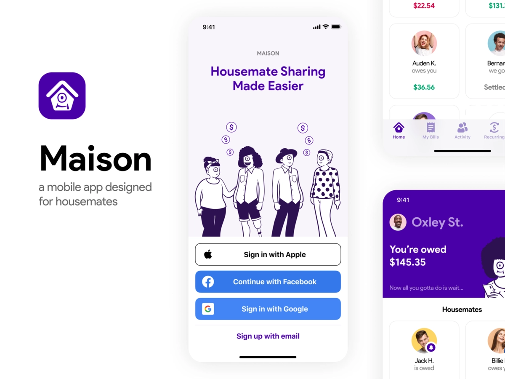

# Maison

> Roommate bill splitting that feels like writing it down on the fridge.

A modern rebuild of an old portfolio project. Web + mobile + shared
backend in one monorepo. Built with TypeScript end-to-end — every API
call is typed from database row to JSX prop.

<p align="center">
  
</p>

---

## What it does

A household ledger for people who share rent.

- **Log bills** — groceries, rent, the absurd Costco run. One-off or
  recurring.
- **Split fairly** — even share by default, custom shares when life
  isn't fair.
- **Settle up** — the algorithm computes net balances across all bills
  and payments, then suggests the fewest transfers to zero everyone out.
- **Web + native** — same data, same types, same auth. Use whichever you
  reach for.

---

## Stack

| Layer            | Choice                                     | Why                                               |
| ---------------- | ------------------------------------------ | ------------------------------------------------- |
| Language         | TypeScript (strict, bundler resolution)    | One language, full type safety                    |
| Web              | Next.js 15 (App Router) + React 19         | Modern defaults; Server Components by default     |
| Mobile           | Expo SDK 52 + React Native + NativeWind    | Same component model, same Tailwind tokens        |
| API              | tRPC v11                                   | End-to-end typed RPC — no schema drift            |
| Database         | Postgres (Neon, serverless) + Prisma 6     | Branchable Postgres; type-safe ORM                |
| Auth             | Clerk                                      | Drop-in identity for web + mobile                 |
| Styling          | Tailwind v4 (web) / Tailwind v3 (mobile)   | CSS-first `@theme` tokens, mirrored to NativeWind |
| Validation       | Zod                                        | Shared schemas: server, client, forms             |
| State (server)   | TanStack React Query                       | Caching + invalidation for tRPC                   |
| Monorepo         | Turborepo + pnpm                           | Workspace caching, parallel builds                |
| Deploy (web)     | Vercel + Neon integration                  | One-click preview branches with DB                |

---

## Architecture

```
maison/
├── apps/
│   ├── web/                       # Next.js 15 (App Router)
│   │   ├── app/                   # Routes — landing, dashboard, /household/[id]
│   │   ├── server/                # tRPC route handler (auth + context)
│   │   ├── trpc/                  # Client + provider
│   │   ├── features/              # Bulletproof-react feature modules
│   │   └── middleware.ts          # Clerk route protection
│   └── mobile/                    # Expo + expo-router
│       ├── app/
│       │   ├── (auth)/            # Sign-in route group
│       │   └── (app)/             # Authenticated route group
│       └── src/features/          # Mirrors apps/web/src/features/
├── packages/
│   ├── api/                       # tRPC routers — shared by web + mobile
│   │   └── src/routers/           #   user · household · bill · payment · settlement
│   ├── db/                        # Prisma schema, migrations, seed scripts
│   └── shared/                    # Zod schemas, money utils, settle-up algorithm
├── legacy/                        # Original Maison app (reference only)
└── CLAUDE.md                      # Coding conventions
```

**Why packages instead of one app/server folder?**
`@maison/api` exports a single `AppRouter` type. Both web and mobile
import it as a workspace dependency and get full IDE autocomplete on
every procedure — no schema generation step, no REST documentation.
Money math (`@maison/shared`) is platform-agnostic so the same
settle-up logic runs identically on Postgres-backed server queries and
unit tests.

---

## Getting started

### Prerequisites

- Node 22+ (a `.nvmrc` is included)
- pnpm 10+
- A [Neon](https://neon.tech) account (Postgres) — or any Postgres
- A [Clerk](https://clerk.com) application

### Setup

```bash
git clone https://github.com/danielcagostinho/Maison.git
cd Maison
pnpm install
```

Provision env vars. The fastest path is the **Vercel + Neon integration**
— it auto-injects `POSTGRES_PRISMA_URL` and `POSTGRES_URL_NON_POOLING`
into the project. After running `vercel link` once:

```bash
vercel env pull .env.local
```

Add your Clerk keys to Vercel's env (or directly to `.env.local`):

```env
CLERK_SECRET_KEY=sk_test_...
NEXT_PUBLIC_CLERK_PUBLISHABLE_KEY=pk_test_...
EXPO_PUBLIC_CLERK_PUBLISHABLE_KEY=pk_test_...   # same value, mobile prefix
```

Apply the schema and seed:

```bash
pnpm db:migrate          # initial migration against Neon
pnpm db:seed             # demo data: 3 users, 1 household, 2 bills, 1 payment
```

Run the web app:

```bash
pnpm --filter @maison/web dev    # http://localhost:3000
```

Sign in via Clerk, then run the personal seed to populate your real
account with realistic data:

```bash
pnpm db:seed:me          # builds "456 Oak St" around the current user
```

Run the mobile app (in a separate terminal):

```bash
pnpm --filter @maison/mobile start   # opens Expo at :8081
```

Scan the QR with Expo Go on your phone, or press `i` / `a` in the
terminal for the iOS simulator / Android emulator. The mobile tRPC
client auto-detects your laptop's LAN IP from Expo's manifest, so a
real device on the same wifi reaches the local Next.js dev server at
`:3000` without further config.

---

## Domain model

```
User           Clerk-backed identity. Profile syncs from Clerk on each
               authed request.

Household      A shared address. Members + currency + bills + payments
               all hang off it.

HouseholdMember
               Join table. Role: OWNER | MEMBER.

Bill           A charge the payer fronted. Has a payer, an amount in
               integer cents, an occurredAt, and a recurrence
               (NONE | WEEKLY | MONTHLY). Recurring instances point at
               a template via parentBillId.

BillSplit      One row per user owing a share of a bill. Sum of
               shareCents equals the bill's amountCents (app-enforced).

Payment        A first-class settle-up transfer between two members.
               Net balances are derived from bills + splits + payments.
```

### Money

Stored as `Int` cents — `2500` means `$25.00`. Floating-point math is
never allowed on currency. `@maison/shared/money` handles the boundary
conversions and the per-penny rounding when splitting evenly across
members.

### Settle-up

`@maison/shared/settle` exposes two pure functions:

- `computeBalances(bills, payments)` — net cents per user across the
  household. Positive = owed money. Negative = owes money.
- `suggestSettlements(balances)` — greedy minimal-transfer settle. Pairs
  the biggest creditor with the biggest debtor each step. Within ~1
  transfer of optimal for any realistic household size, runs in
  O(n log n).

---

## What works today

- ✅ Sign in / sign up via Clerk (Google + email)
- ✅ Web: landing → dashboard → household detail with bills, payments,
  balances, suggested settle-ups
- ✅ Create a household from the dashboard (wired to a tRPC mutation)
- ✅ Mobile: sign in, dashboard with household list
- ✅ Auto-provisioning of a `User` row from Clerk profile on first
  authed request (idempotent via upsert, self-heals on profile change)
- ✅ Personal seed script (`pnpm db:seed:me`) for realistic dev data

## What's next

- Bill creation UI (web + mobile) — schema and tRPC routes already exist
- Settle-up "mark paid" flow (creates a `Payment` from a suggested
  transfer)
- Invite-by-link flow for new household members
- Recurring bill scheduler (cron generates `Bill` instances from
  recurrence templates)
- Tests — Vitest for `@maison/shared` algorithms, integration tests
  for the tRPC routers
- Mobile household detail screen (mirror of the web page)

---

## Conventions

Project conventions live in [CLAUDE.md](./CLAUDE.md) — adapted from
[bulletproof-react](https://github.com/alan2207/bulletproof-react) for
this stack. Covers TypeScript style, file naming, the feature-folder
import discipline, the API three-part pattern (Zod → procedure →
hook), the money/time conventions, and the Tailwind spacing rule
(`gap` over `margin`, always).

---

## Legacy

The original Maison was a React Native + Mongoose app built as a
school portfolio project. It lives under [`/legacy`](./legacy) for
reference — design language, illustrations, and the Product Sans
typography you see in the new build are pulled directly from it.
